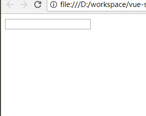
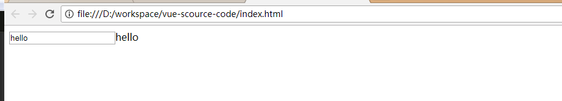

# vue-scource-code
这两天公司设计出设计图，终于空出点儿时间看看大VUE，之前一直用ng和vue，感觉里面模板，双向数据绑定贼6x，最近稍微闲了那么一丢丢，就静下心来看看里面的一些实现原理，看来一下双向数据绑定是怎么搞出来的。也算对自己能力的一个提升，探索一下我没有掌握的前端未知区域。得更紧前辈们的脚步。

网上说实现数据绑定做法有大概三种

- **发布者-订阅者(backone.js)**
- **脏值检查(angular.js)**
- **数据劫持(vue.js)**

然后只看了vue的中双向数据绑定的原理，ng的就没有去搞了，要支持大国产嘛。backone.js也是在网上不小心看到，根本没有用过，之前都没有听说过（怪我学疏才浅，是个前端菜鸟，也不用去搞那么多，先搞懂一个再说，其它的在慢慢来，说不定以后就不干程序的勾当了呢）

#### 数据劫持 

​	vue.js采用的是数据劫持结合发布者-订阅者模式的方式,通过Object.defineProperty()这个方法来劫持各个属性的getter和setter。如果有对Object.defineProperty()不太懂的，直接百度就行了。这儿就不详细叙述了

本文参考1:http://www.cnblogs.com/kidney/p/6052935.html?utm_source=gold_browser_extension

本文参考2:https://segmentfault.com/a/1190000006599500

废话就不多说了，直接先来上段代码块儿，先通过Object.defineProperty()实现一个简单双向数据绑定,通过Object.defineProperty()来监听属性的变动，然后在触发set函数，从而触发视图的更新

##### 1.简单的双向数据绑定

```html
<!DOCTYPE html>
<html lang="en">
<head>
	<meta charset="UTF-8">
	<title>Document</title>
</head>
<body>
	<input type="text" name="" id="i-msg">
	<span id="text"></span>
</body>
</html>

<script type="text/javascript">
	var data = {}
	Object.defineProperty(data, 'test', {
		enumerable: true, //可枚举
		configurable: false, //不可从新define
		get: function(){
			return val
		},
		set: function(newvale){
			document.getElementById('i-msg').value = newvale
			document.getElementById('text').innerHTML = newvale
		}
	})
	document.addEventListener('keyup', function(e){
		data.test = e.target.value; //触发data中set函数
	})
</script>
```



监听文档的keyup事件，每次keyup事件都会触发Object.defineProperty()中的set函数，从而动态的给input和span赋值，从而实现简单双向数据绑定，当然不会就这么简单的，下面来分布分析

##### 1.模板解析

我们大家都知道在vue中会有一个根元素

```html
<div id="app">
  ....
</div>
```

那么vue是怎么解析的呢,这儿就用文档碎片DocumentFragment是一个轻量级的文档，可以包含和控制节点，但不会像文档那样占用额外的资源。虽然不能把文档碎片直接添加到文档中，但可以将它作为一个“仓库”来使用，即可以在里面保存将来要添加到文档的节点。如果将文档中的节点添加到文档片段中，就会从文档树种移除该节点。vue的模板解析就是用到这点儿（我的理解和一些参考）

下面是简单html模板

```html
<!DOCTYPE html>
<html lang="en">
<head>
	<meta charset="UTF-8">
	<title>vue-simple-scource-code</title>
</head>
<body>
	<div id="app">
		<input type="text" name="" id="i-msg" v-model="msg">
		{{msg}}
	</div>
</body>
</html>
<script src="compile.js"></script>

```


compile.js

```javascript


/**
 * 把需要解析的模板添加到文档碎片中
 * @param {object} node 需要解析的文档
 */
function addToFragment(node){
	var frag = document.createDocumentFragment(); //创建文档碎片
	var child;
	//循环直到把所有的的子节点都添加到文档碎片中
	while (child = node.firstChild) {
		frag.appendChild(child)  //把节点添加到文档碎片中，并在文档中移除该节点
	}
	return frag
}

var node = document.getElementById('app')
addToFragment(node)
```

把文档中id为app的所有子元素都添加到文档碎片中，方便以后使用。这样文档中app下就没有任何子元素了

##### 2.初始化数据

上面第一步拿到模板，现在要把数据添加到文档碎片中，并展现到页面中,就是我们通常的

```javascript
var vm = new Vue({
	el: 'app',
	data: {
		msg: 'hello'
	}
})
```

修改index.html

```html
<!DOCTYPE html>
<html lang="en">
<head>
	<meta charset="UTF-8">
	<title>vue-simple-scource-code</title>
	<script src="compile.js"></script>
</head>
<body>
	<div id="app">
		<input type="text" name="" id="i-msg" v-model="msg">
		{{msg}}
	</div>
</body>
</html>
<script type="text/javascript">
	var vm = new Vue({
		el: 'app',
		data: {
			msg: 'hello'
		}
	})
</script>
```

修改后的compile.js

```javascript

/**
 * 把需要解析的模板添加到文档碎片中
 * @param {object} node 需要解析的文档
 */
function addToFragment(node, vm){
	var frag = document.createDocumentFragment(); //创建文档碎片
	var child;
	//循环直到把所有的的子节点都添加到文档碎片中
	while (child = node.firstChild) {
		compile(child,vm)
		frag.appendChild(child)  //把节点添加到文档碎片中，并在文档中移除该节点
	}
	return frag
}
/**
 * 把数据添加到文档碎片中
 * @param  {object} node 需要添加的节点
 * @param  {object} vm   实例化的数据
 * @return {object}      null
 */
function compile(node, vm){
	var reg = /\{\{(.*)\}\}/; // 正则匹配{{msg}}
	// 节点类型是元素
	if (node.nodeType === 1) {
		var attr = node.attributes;
		// 解析自定义属性
		for(var i = 0; i < attr.length; i++){
			if (attr[i].nodeName == 'v-model') {
				var name = attr[i].nodeValue;  //解析自定义属性v-model 
				node.value = vm.data[name]; // 并将实例化vm中对应的值赋给该点
				node.removeAttribute('v-model'); //移除自定义属性，防止在页面上显示出来
			}
		}
	}
	// 如果是文档
	if (node.nodeType === 3) {
		if (reg.test(node.nodeValue)) {
			var name = RegExp.$1; // 获取{{msg}} 中的字符串
			name = name.trim();
			node.nodeValue = vm.data[name]
		}
	}
}


function Vue(opt){
	if (!opt) {
		console.warn('需要传入实例化参数')
		return
	}
	this.data = opt.data
	var id = opt.el
	var dom = addToFragment(document.getElementById(id),this)
	document.getElementById(id).appendChild(dom) //把文档碎片到文档中
}
```



通过上面的修改实现了初始化

##### 3.发布与订阅

前面实现了初次化，可以把实例化中的data的值绑定到文档中，但是我们还没有实现数据双向绑定，我们最开始提到要用到最重要的object.defineProperty()函数实现简单的数据双向绑定。只要属性“msg”发生了变化，就触发set函数，然后通知对应的视图进行更新

observer.js

```javascript
/**
 * 	定义一个订阅者容器
 */
function Dep(){
	this.subs = []
}
Dep.prototype = {
	addSubs: function(sub){
		this.subs.push(sub)
	},
	notify: function(){
		this.subs.forEach(function(sub){
			sub.update()
		})
	}

}
```

上面Dep的原型有两个函数，一个是添加订阅者，一个是通知订阅者更新视图。

```javascript
/**
 * 	实现数据监听，数据变换触发set函数，通知相应的观察者
 */

function observer(data, vm){
	if (!data ||typeof data !== 'object') return
	Object.keys(data).foeEach(function(key){
		defineReactive(vm, key, data[key])
	})
}
function defineReactive(vm, key, val){
	var dep = new Dep()
	Object.defineProperty(vm, key, {
		enumerable: true, // 可枚举,
		configurable: false,// 不可define
		get: function(){
			return val
		},
		set:function(newValue){
			if (val === newValue) return
			dep.notify() // 数据发生改变通知订阅者更新
		}
	})
}

/**
 * 	定义一个订阅者容器
 */
function Dep(){
	this.subs = []
}
Dep.prototype = {
	addSubs: function(sub){
		this.subs.push(sub)
	},
	notify: function(){
		this.subs.forEach(function(sub){
			sub.update()
		})
	}

}
```

上面observer.js完成了数据的监听，数据发生变化后通知订阅者，让订阅者去通知相应的视图发生改变,但是该通知哪一个订阅者呢？订阅者如何添加呢？

下面实现订阅者watcher。watcher是非常重要的一个角色，他是连接compile跟observer的桥梁，view=>model和model=>view都得搞watcher来实现，数据发生了改天通知watcher，让watcher通知那个视图更新。视图更新了让watcher通知那个数据发生改变

watcher.js

